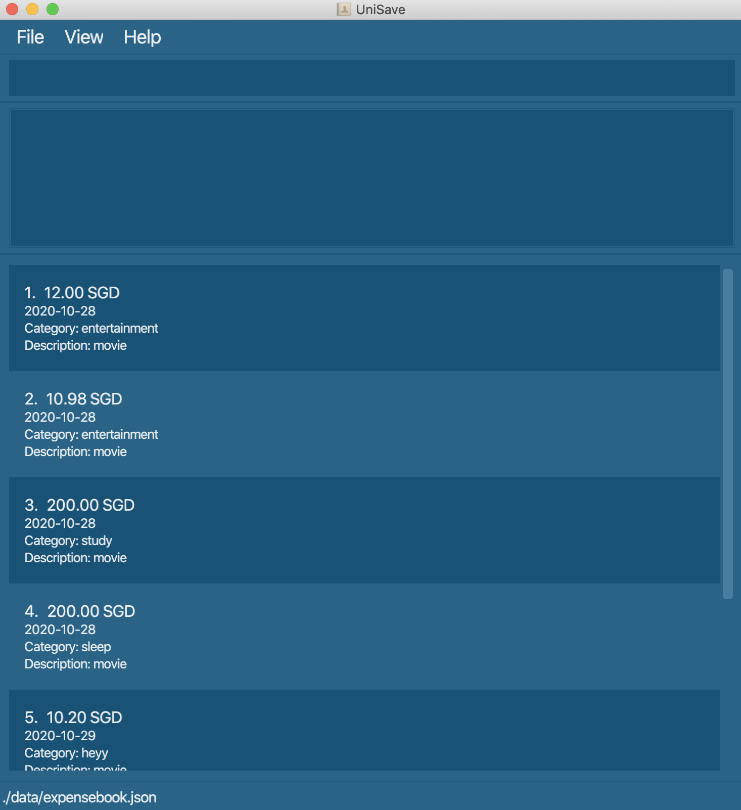

## UniSave

UniSave is a desktop finance planner app, optimized for use via a Command Line Interface (CLI) while still having
the benefits of a Graphical User Interface (GUI). If you can type fast, UniSave can get your financial management
tasks done faster than traditional GUI apps.

### Documentation
- [User Guide](https://ay2021s1-cs2103t-w10-1.github.io/tp/UserGuide.html)
- [Developer Guide](https://ay2021s1-cs2103t-w10-1.github.io/tp/DeveloperGuide.html)

### Acknowledgement
This project is based on the AddressBook-Level3 project created by the [SE-EDU initiative](https://se-education.org).
