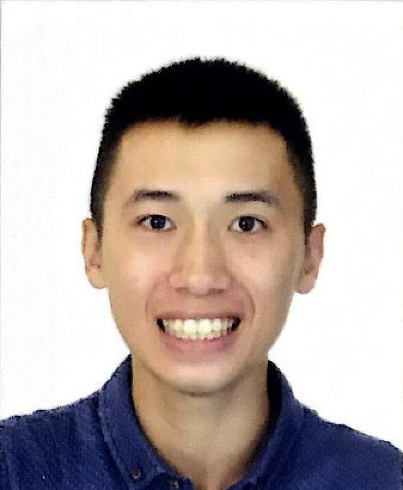
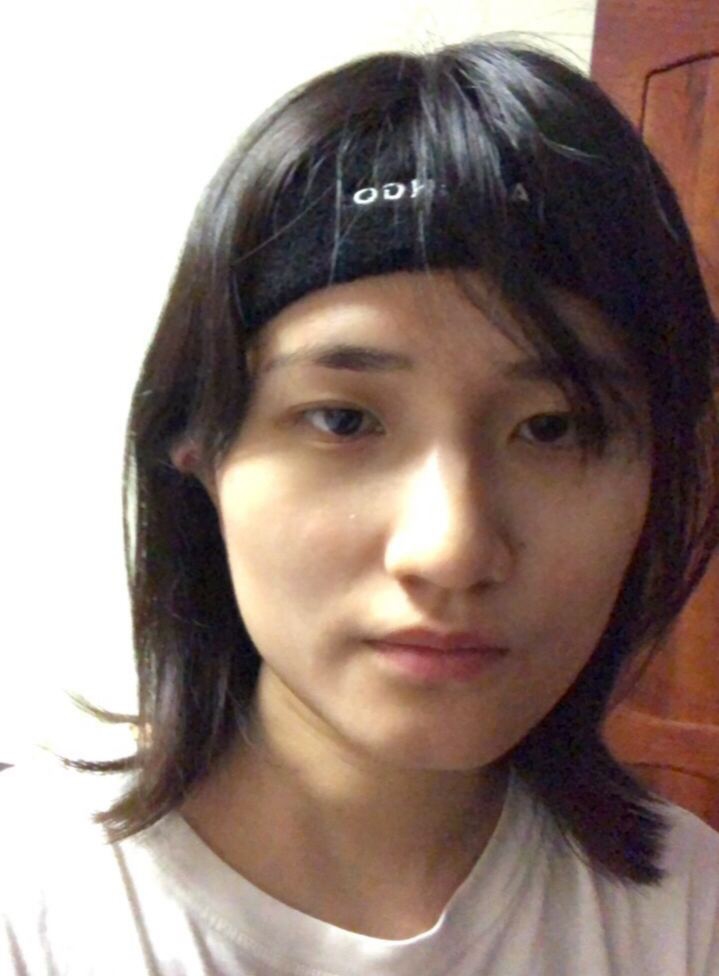

We are a team based in the [School of Computing, National University of Singapore](http://www.comp.nus.edu.sg).

You can reach us at the email `seer[at]comp.nus.edu.sg`

## Project team

### Xie Yaoren

[[github](https://github.com/BILLXYR)]
[[portfolio](team/billxyr.md)]

* Role: Developer, Testing
* Responsibilities: Model

### Wayne Tan Kin Lun

[[github](https://github.com/tanwayne890)]
[[portfolio](team/tanwayne890.md)]

* Role: Developer, Deliverables & Deadlines
* Responsibilities: UI

### Zhang Yuanxing

[[github](https://github.com/yuanxing-y)]
[[portfolio](team/yuanxing-y.md)]

* Role: Developer, Documentation & Code Quality
* Responsibilities: Model, Logic

### Yao Yuming

[[github](https://github.com/yuming7144)]
[[portfolio](team/yuming7144.md)]

* Role: Developer, Scheduling & Tracking
* Responsibilities: Dev Ops + Threading

### Yang Yutong

[[github](https://github.com/yyutong)]
[[portfolio](team/yyutong.md)]

* Role: Developer, Team Lead, Integration
* Responsibilities: UI
