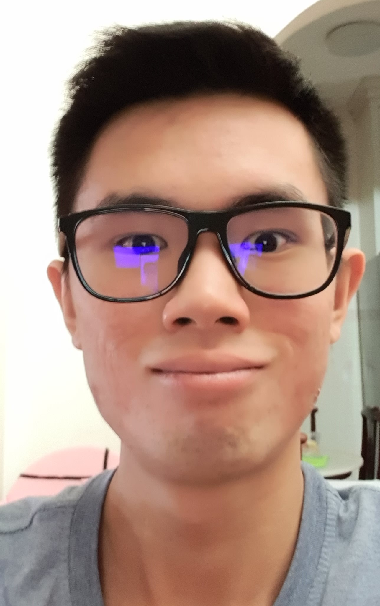

We are a team based in the [School of Computing, National University of Singapore](http://www.comp.nus.edu.sg).

You can reach us at the email `seer[at]comp.nus.edu.sg`

## Project team

### Xie Yaoren

[[homepage](http://www.comp.nus.edu.sg/~damithch)]
[[github](https://github.com/johndoe)]
[[portfolio](team/johndoe.md)]

* Role: Testing
* Responsibilities: Model

### Wayne Tan Kin Lun

[[github](http://github.com/johndoe)]
[[portfolio](team/johndoe.md)]

* Role: Deliverables & Deadlines
* Responsibilities: UI

### Zhang Yuanxing

[[github](http://github.com/johndoe)] [[portfolio](team/johndoe.md)]

* Role: Documentation & Code Quality
* Responsibilities: Data, Storage

### Yao Yuming

[[github](http://github.com/johndoe)]
[[portfolio](team/johndoe.md)]

* Role: Scheduling & Tracking
* Responsibilities: Dev Ops + Threading

### Yang Yutong

[[github](http://github.com/johndoe)]
[[portfolio](team/johndoe.md)]

* Role: Developer
* Responsibilities: UI
