* Table of Contents
{:toc}

--------------------------------------------------------------------------------------------------------------------

## 1. **Overview**
Welcome to UniSave Developer Guide. This documentation provides you an insight on how UniSave is designed and implemented.

## 1.1 Introduction
UniSave is a **desktop app for managing expenses, optimized for use via a Command Line Interface** (CLI).

It is an application that helps university students manage their finance by tracking your spending, 
setting budget for each month, as well as viewing their expenses in various categories. 
Moreover, UniSave allows tracking expenses in different currencies.

UniSave targets university students who tend to incur a large amount of spending.
It is catered especially for students who are more familiar with desktop applications and type fast.
UniSave is available for the Linux, Windows and Mac OS operating systems.
 
## 1.2 Setting Up, Getting Started
Refer to the guide [_Setting up and getting started_](SettingUp.md).

--------------------------------------------------------------------------------------------------------------------

## **Design**

### Architecture

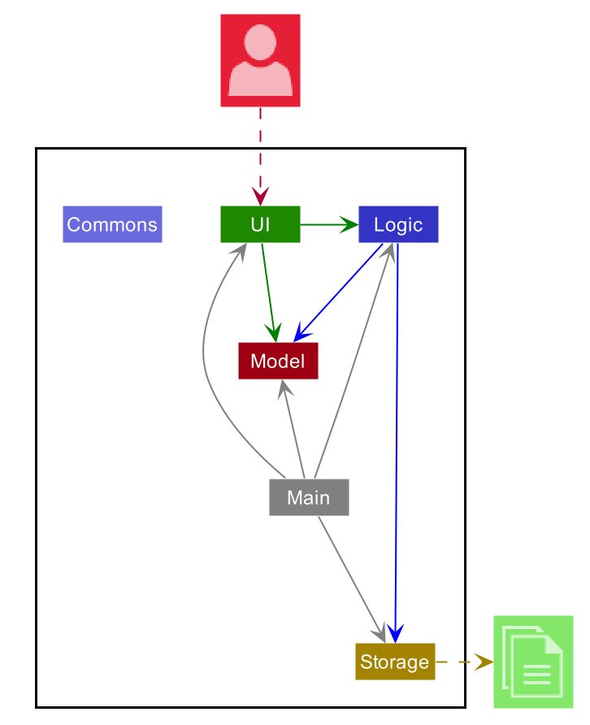

The ***Architecture Diagram*** given above explains the high-level design of the App. Given below is a quick overview of each component.

:bulb: **Tip:** The `.puml` files used to create diagrams in this document can be found in the [diagrams](https://github.com/se-edu/addressbook-level3/tree/master/docs/diagrams/) folder. Refer to the [_PlantUML Tutorial_ at se-edu/guides](https://se-education.org/guides/tutorials/plantUml.html) to learn how to create and edit diagrams.

**`Main`** has two classes called [`Main`](https://github.com/se-edu/addressbook-level3/tree/master/src/main/java/seedu/address/Main.java) and [`MainApp`](https://github.com/se-edu/addressbook-level3/tree/master/src/main/java/seedu/address/MainApp.java). It is responsible for,
* At app launch: Initializes the components in the correct sequence, and connects them up with each other.
* At shut down: Shuts down the components and invokes cleanup methods where necessary.

[**`Commons`**](#common-classes) represents a collection of classes used by multiple other components.

The rest of the App consists of four components.

* [**`UI`**](#ui-component): The UI of the App.
* [**`Logic`**](#logic-component): The command executor.
* [**`Model`**](#model-component): Holds the data of the App in memory.
* [**`Storage`**](#storage-component): Reads data from, and writes data to, the hard disk.

Each of the four components,

* defines its *API* in an `interface` with the same name as the Component.
* exposes its functionality using a concrete `{Component Name}Manager` class (which implements the corresponding API `interface` mentioned in the previous point.

For example, the `Logic` component (see the class diagram given below) defines its API in the `Logic.java` interface and exposes its functionality using the `LogicManager.java` class which implements the `Logic` interface.

**How the architecture components interact with each other**

The *Sequence Diagram* below shows how the components interact with each other for the scenario where the user issues the command `delete 1`.

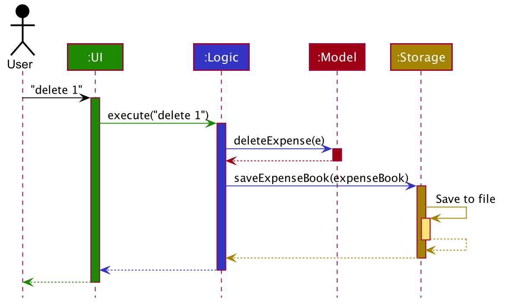

The sections below give more details of each component.

### UI component

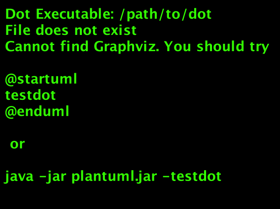

**API** :
[`Ui.java`](https://github.com/se-edu/addressbook-level3/tree/master/src/main/java/seedu/address/ui/Ui.java)

The UI consists of a `MainWindow` that is made up of parts e.g.`CommandBox`, `ResultDisplay`, `ExpenseListPanel`, `StatusBarFooter` etc. All these, including the `MainWindow`, inherit from the abstract `UiPart` class.

The `UI` component uses JavaFx UI framework. The layout of these UI parts are defined in matching `.fxml` files that are in the `src/main/resources/view` folder. For example, the layout of the [`MainWindow`](https://github.com/se-edu/addressbook-level3/tree/master/src/main/java/seedu/address/ui/MainWindow.java) is specified in [`MainWindow.fxml`](https://github.com/se-edu/addressbook-level3/tree/master/src/main/resources/view/MainWindow.fxml)

The `UI` component,

* Executes user commands using the `Logic` component.
* Listens for changes to `Model` data so that the UI can be updated with the modified data.

### Logic component

**API** :
[`Logic.java`](https://github.com/se-edu/addressbook-level3/tree/master/src/main/java/seedu/address/logic/Logic.java)

1. `Logic` uses the `AddressBookParser` class to parse the user command.
1. This results in a `Command` object which is executed by the `LogicManager`.
1. The command execution can affect the `Model` (e.g. adding a expense).
1. The result of the command execution is encapsulated as a `CommandResult` object which is passed back to the `Ui`.
1. In addition, the `CommandResult` object can also instruct the `Ui` to perform certain actions, such as displaying help to the user.

Given below is the Sequence Diagram for interactions within the `Logic` component for the `execute("delete 1")` API call.

:information_source: **Note:** The lifeline for `DeleteCommandParser` should end at the destroy marker (X) but due to a limitation of PlantUML, the lifeline reaches the end of diagram.

### Model component

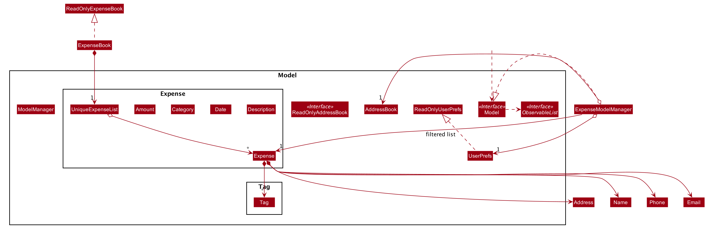

**API** : [`Model.java`](https://github.com/se-edu/addressbook-level3/tree/master/src/main/java/seedu/address/model/Model.java)

The `Model`,

* stores a `UserPref` object that represents the user’s preferences.
* stores the expense book data.
* exposes an unmodifiable `ObservableList<Expense>` that can be 'observed' e.g. the UI can be bound to this list so that the UI automatically updates when the data in the list change.

### Storage component

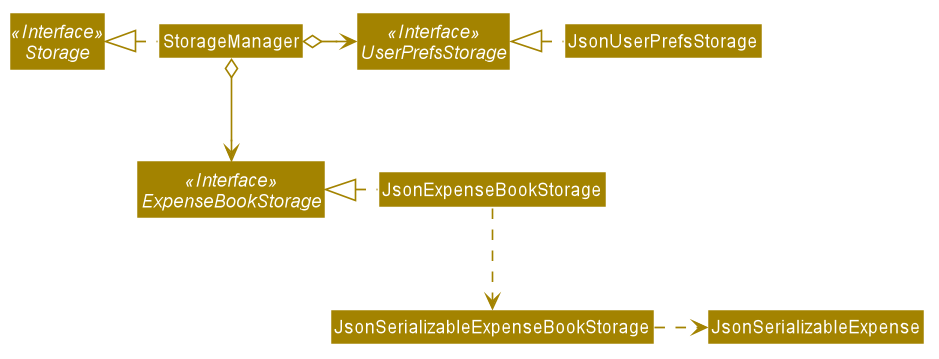

**API** : [`Storage.java`](https://github.com/AY2021S1-CS2103T-W10-1/tp/blob/master/src/main/java/seedu/address/storage/Storage.java)

The `Storage` component,
* can save `UserPref` objects in json format and read it back.
* can save the expense book data in json format and read it back.

### Common classes

Classes used by multiple components are in the `seedu.addressbook.commons` package.

--------------------------------------------------------------------------------------------------------------------

## **Implementation**

This section describes some noteworthy details on how certain features are implemented.

### Expense Management Feature

As an expense management application, the most important features are to be able to add, edit, view and delete your
expenses.

This section will cover the details of the current implementation and design considerations of
the description management feature.

#### Current Implementation

The expense management feature supports six main operations:

* `add` - record an expense, with an amount, a date, a category and a description as fields.
* `view` - view the details of an existing expense.
* `edit` - edit the details of an existing expense.
* `delete` - delete an existing expense from the expense list.
* `add-d` - add a description to an existing expense.
* `delete-d` - delete the description of an existing expense.

### Expense model

The add expense, view expense, edit expense, delete expense, as well as add description features and delete description
feature are mainly supported by the `Expense` class.

Given below is the class diagram of the `Expense` class.

Fig. Class Diagram for Expense.
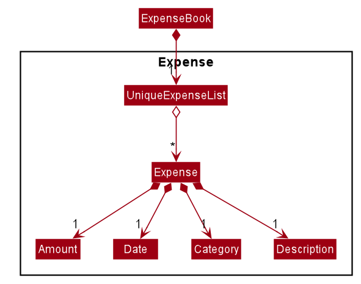

#### Add Expense feature

Given below is an example usage scenario and how the mechanism for adding expenses behaves at each step.

The following activity diagram summarizes what happens when a user executes the `AddExpenseCommand`:

Fig. Activity Diagram for the Execution of `AddExpenseCommand`

Step 1. The user launches the application.

Step 2. Unisave displays a list of existing expenses in the UI.

Step 3. The user executes `Spent on books` to add the description 
"Spent on books" to the expense with index 2 in the displayed expense list.
The `AddDescriptionCommand` calls `Description` to create a new description object and a new Expense object containing 
this newly created description object, and replace the previous expense object with this updated expense in the 
`ExpenseList` stored in `UniSave`.

The sequence diagram below shows the high-level abstraction of how Unisave processes user request
to execute `addDes 2 d/Spent on books`:

High Level Sequence Diagram for the Execution of `addDes 2 d/Spent on books`
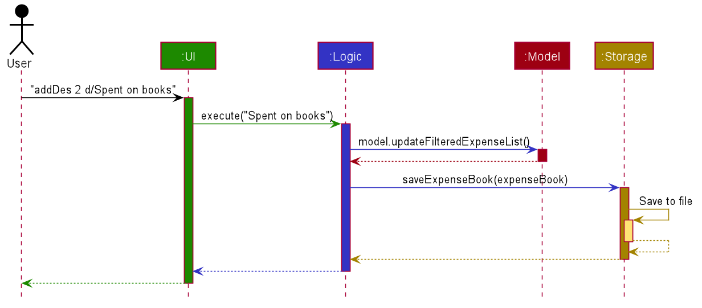

#### Design Considerations

##### Aspect: How to manage empty description, as description is optional.

* Alternative 1 (current choice): Use empty string to create description, if description is empty.
** Pros: Expense always contains a description object. No possibility of 0 description object in expense.
** Cons: When deleting the description, the description object is not deleted and "Description:" field is still shown on UI.
* Alternative 2: Use an `Optional` for descriptions.
** Pros: More intuitive.
** Cons: Harder to manage and prone to error.

#### Edit expense feature

The add description features and delete description feature are mainly supported by the `Expense` class.

Given below is the class diagram of the `Expense` class.

Fig. Class Diagram for Expense.

Given below is an example usage scenario and how the mechanism for adding description to expenses behaves at each step.

The following activity diagram summarizes what happens when a user executes the `AddDescriptionCommand`:

Fig. Activity Diagram for the Execution of `AddTaskCommand`

Step 1. The user launches the application.

Step 2. Unisave displays a list of existing expenses in the UI.

Step 3. The user executes `Spent on books` to add the description 
"Spent on books" to the expense with index 2 in the displayed expense list.
The `AddDescriptionCommand` calls `Description` to create a new description object and a new Expense object containing 
this newly created description object, and replace the previous expense object with this updated expense in the 
`ExpenseList` stored in `UniSave`.

The sequence diagram below shows the high-level abstraction of how Unisave processes user request
to execute `addDes 2 d/Spent on books`:

High Level Sequence Diagram for the Execution of `addDes 2 d/Spent on books`

#### Design Considerations

##### Aspect: How to manage empty description, as description is optional.

* Alternative 1 (current choice): Use empty string to create description, if description is empty.
** Pros: Expense always contains a description object. No possibility of 0 description object in expense.
** Cons: When deleting the description, the description object is not deleted and "Description:" field is still shown on UI.
* Alternative 2: Use an `Optional` for descriptions.
** Pros: More intuitive.
** Cons: Harder to manage and prone to error.

#### Add description

As an expense management application, one of the most important features is to add a description when
recording down and tracking the expenses, so that later when users review their expenses, they have a better
idea of what he spent on. 

The add description features and delete description feature are mainly supported by the `Expense` class.

Given below is the class diagram of the `Expense` class.

Fig. Class Diagram for Expense.

Given below is an example usage scenario and how the mechanism for adding description to expenses behaves at each step.

The following activity diagram summarizes what happens when a user executes the `AddDescriptionCommand`:

Fig. Activity Diagram for the Execution of `AddTaskCommand`

Step 1. The user launches the application.

Step 2. Unisave displays a list of existing expenses in the UI.

Step 3. The user executes `Spent on books` to add the description 
"Spent on books" to the expense with index 2 in the displayed expense list.
The `AddDescriptionCommand` calls `Description` to create a new description object and a new Expense object containing 
this newly created description object, and replace the previous expense object with this updated expense in the 
`ExpenseList` stored in `UniSave`.

The sequence diagram below shows the high-level abstraction of how Unisave processes user request
to execute `addDes 2 d/Spent on books`:

High Level Sequence Diagram for the Execution of `addDes 2 d/Spent on books`

#### Design Considerations

##### Aspect: How to manage empty description, as description is optional.

* Alternative 1 (current choice): Use empty string to create description, if description is empty.
** Pros: Expense always contains a description object. No possibility of 0 description object in expense.
** Cons: When deleting the description, the description object is not deleted and "Description:" field is still shown on UI.
* Alternative 2: Use an `Optional` for descriptions.
** Pros: More intuitive.
** Cons: Harder to manage and prone to error.

### \[Proposed\] Delete Expense feature

#### Proposed Implementation

The proposed delete mechanism is facilitated by `VersionedExpenseBook`. It extends `ExpenseBook` and stored internally as an `ExpenseBookStateList` and `currentStatePointer`. Additionally, it implements the following operations:

* `VersionedExpenseBook#save()` — Saves the current expense book state in its history.
* `VersionedExpenseBook#delete()` — Restores the previous expense book state from its history.

These operations are exposed in the `Model` interface as `Model#saveExpenseBook()`, `Model#deleteExpenseBook()` respectively.

Given below is an example usage scenario and how the delete mechanism behaves at each step.

Step 1. The user launches the application for the first time. The `VersionedExpenseBook` will be initialized with the initial address book state, and the `currentStatePointer` pointing to that single expense book state.

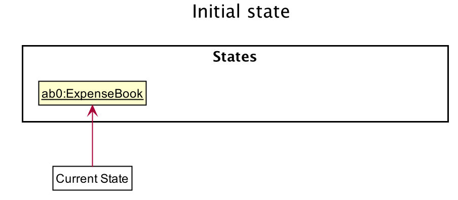

Step 2. The user executes `delete 5` command to delete the 5th expenses in the expense book. The `delete` command calls `Model#saveExpenseBook()`, causing the modified state of the expense book after the `delete 5` command executes to be saved in the `expenseBookStateList`, and the `currentStatePointer` is shifted to the newly inserted expense book state.

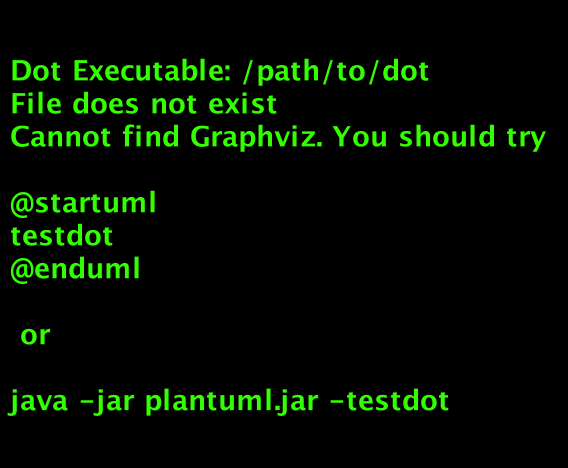

Step 3. The user executes `add a/100 c/Entertainment D/1 d/Movie` to add a new expense. The `add` command also calls `Model#saveAddressBook()`, causing another modified expense book state to be saved into the `expenseBookStateList`.

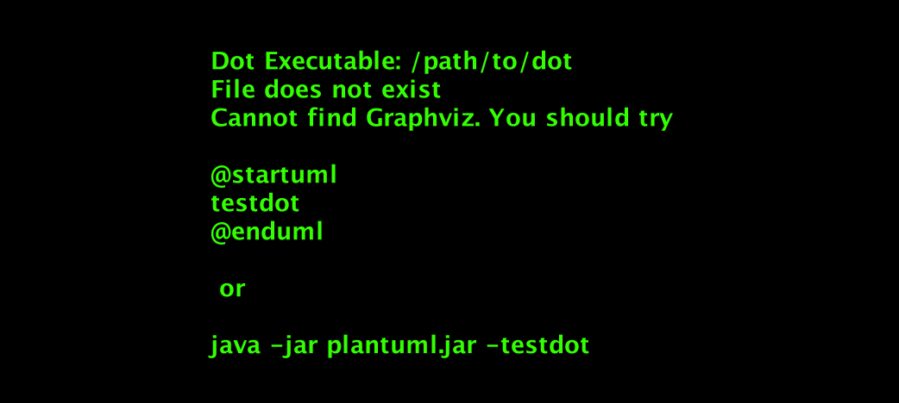

:information_source: **Note:** If a command fails its execution, it will not call `Model#saveExpenseBook()`, so the expense book state will not be saved into the `expenseBookStateList`.

Step 4. The user now decides that adding the expense was a mistake, and decides to delete that expense by executing the `delete` command. The `delete` command will call `Model#deleteExpenseBook()`, which will shift the `currentStatePointer` once to the left, pointing it to the previous expense book state, and restores the expense book to that state.

:information_source: **Note:** If the `currentStatePointer` is at index 0, pointing to the initial ExpenseBook state, then there are no previous ExpenseBook states to restore. The `delete` command uses `Model#canDeleteExpenseBook()` to check if this is the case. If so, it will return an error to the user rather
than attempting to perform the undo.

The following sequence diagram shows how the delete operation works:

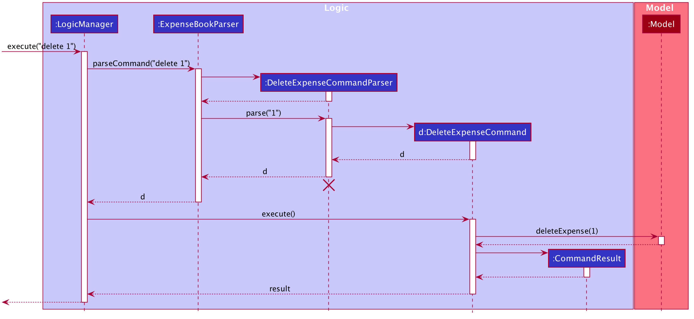

:information_source: **Note:** The lifeline for `DeleteExpenseCommand` should end at the destroy marker (X) but due to a limitation of PlantUML, the lifeline reaches the end of diagram.

The `redo` command does the opposite — it calls `Model#redoAddressBook()`, which shifts the `currentStatePointer` once to the right, pointing to the previously undone state, and restores the address book to that state.

:information_source: **Note:** If the `currentStatePointer` is at index `addressBookStateList.size() - 1`, pointing to the latest address book state, then there are no undone AddressBook states to restore. The `redo` command uses `Model#canRedoAddressBook()` to check if this is the case. If so, it will return an error to the user rather than attempting to perform the redo.

Step 5. The user then decides to execute the command `list`. Commands that do not modify the address book, such as `list`, will usually not call `Model#commitAddressBook()`, `Model#undoAddressBook()` or `Model#redoAddressBook()`. Thus, the `addressBookStateList` remains unchanged.

Step 6. The user executes `clear`, which calls `Model#commitAddressBook()`. Since the `currentStatePointer` is not pointing at the end of the `addressBookStateList`, all address book states after the `currentStatePointer` will be purged. Reason: It no longer makes sense to redo the `add n/David …​` command. This is the behavior that most modern desktop applications follow.

The following activity diagram summarizes what happens when a user executes a new command:

#### Design consideration:

##### Aspect: How undo & redo executes

* **Alternative 1 (current choice):** Saves the entire address book.
  * Pros: Easy to implement.
  * Cons: May have performance issues in terms of memory usage.

* **Alternative 2:** Individual command knows how to undo/redo by
  itself.
  * Pros: Will use less memory (e.g. for `delete`, just save the expense being deleted).
  * Cons: We must ensure that the implementation of each individual command are correct.

_{more aspects and alternatives to be added}_

### \[Proposed\] Data archiving

_{Explain here how the data archiving feature will be implemented}_

### \[Proposed\] List feature

#### Proposed Implementation

The proposed list feature belongs to `ListExpenseCommand` extends `Command`. This list feature will not modify the expense list of UniSave.
`ListExpenseCommand` is created at `ExpenseBookParser` which is called by `LogicManager` to parse input string into `Command`.
`LogicManager` takes in input string from `CommandBox` which belongs to one of the GUI component.

Given below is an example usage scenario of how the list feature behaves at each step.

Step 1. User initializes the app. `ExpenseModelManager` extends `Model`, has a FilteredList of expenses.  
Step 2. After user inputs list command, the steps can be shown from this sequence diagram.

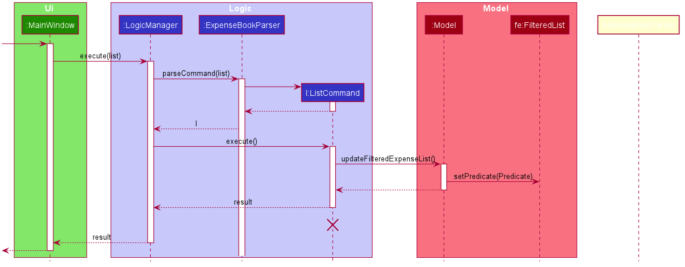

:information_source: **Note:**  
`FilteredList` is a JavaFX class that wraps an `ObservableList` and filters it's content using the provided Predicate. 

Step 3: As we can see from the sequence diagram, a result is also returned to `UI` and shown to the app GUI.

The following activity diagram summarizes what happens when a user executes a new command:

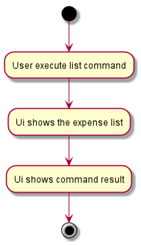

#### Show Budget feature

The show budget feature is mainly supported by the `ExpenseBook` class.

The following activity diagram summarizes what happens when a user executes a new command:

Fig. Activity Diagram for the Execution of `ShowBudgetCommand`
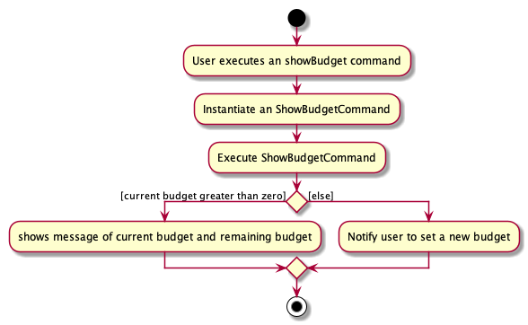

Step 1. The user launches the application.

Step 2. Unisave displays a list of existing expenses in the UI.

Step 3. User set a budget.

Step 4. The user executes `showBudget` to check the current budget.
UI shows the message of current budget and remaining budget.

The sequence diagram below shows the high-level abstraction of how Unisave processes user request
to execute `showBudget` when a budget was set:

High Level Sequence Diagram for the Execution of `showBudget`.
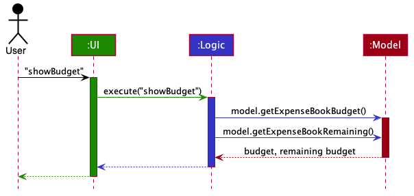

#### Design Considerations

##### Aspect: How to handle the case when the remaining budget is negative (i.e. current spending exceed the budget).

* Alternative 1 (current choice): Show the remaining budget at negative value, and ask the user to set a new budget.
  * Pros: Expense always contains a description object. No possibility of 0 description object in expense.
  * Cons: Is not supposed to happen in real life, not intuitive.

* Alternative 2: Show alerts when the user is overspending, and does not allow the user to spend more before set a new budget.
  * Pros: No more negative budget, more intuitive.
  * Cons: Much more complicated implementation.

#### View an expense 

The view expense feature is facilitated by the `ExpenseBook` class.

Given below is the class diagram of the `ExpenseBook` class.

Fig. Class Diagram for ExpenseBook.

Given below is an example usage scenario and how the mechanism of viewing an expense behaves at each step.

The following activity diagram summarizes what happens when a user executes the `ViewCommand`:

Fig. Activity Diagram for the Execution of `ViewCommand`
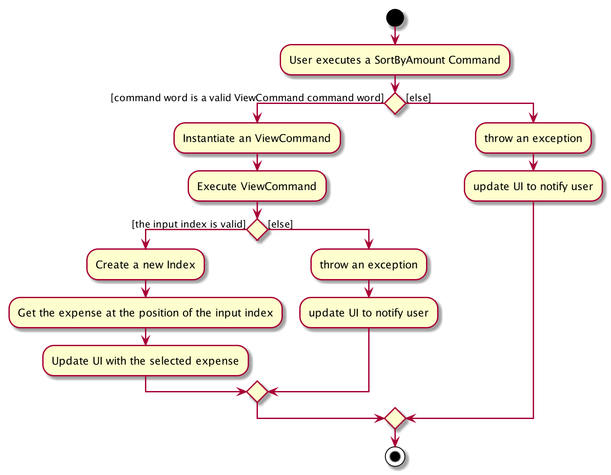

Step 1. The user launches the application.

Step 2. Unisave displays a list of existing expenses in the UI.

Step 3. The user executes `view 1` to view the details of the expense with index 1(the first expense) 
in the displayed expense list.
The `ViewCommand` searches for the first expense in the `ExpenseList` stored in `UniSave`
and creates a CommandResult which contains the details of the first expense found in the list.

The sequence diagram below shows the high-level abstraction of how Unisave processes user request
to execute `view 1`:

High Level Sequence Diagram for the Execution of `view 1`

#### Design Considerations

##### Aspect: How to manage empty description, as description is optional.

* Alternative 1: Directly see the expense from the UI.
** Pros: No need to type in any command.
** Cons: May take some time to scroll down the list to look for the correct index, especially when the 
         expense list is sorted by date/amount.
         
         
#### View all existing expense categories 

The view existing expense categories feature is facilitated by the ExpenseBook class.

Given below is the class diagram of the `ExpenseBook` class.

Fig. Class Diagram for Expense.

Given below is an example usage scenario and how the mechanism of viewing an expense behaves at each step.

The following activity diagram summarizes what happens when a user executes the `ViewCategoryCommand`:

Fig. Activity Diagram for the Execution of `viewCategory`

Step 1. The user launches the application.

Step 2. Unisave displays a list of existing expenses in the UI.

Step 3. The user executes `viewCategory` to view all the existing expense category labels 
        in the ExpenseBook in Unisave.
The `ViewCategoryCommand` searches for the first expense in the `ExpenseList` stored in `UniSave`
and creates a CommandResult which contains the details of the first expense found in the list.

The sequence diagram below shows the high-level abstraction of how Unisave processes user request
to execute `viewCategory`:

High Level Sequence Diagram for the Execution of `viewCategory`
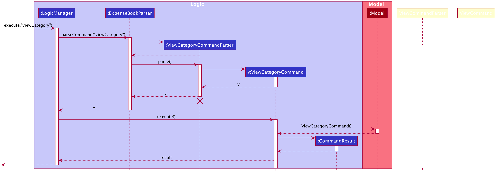

#### Design Considerations

##### Aspect: How to manage empty description, as description is optional.

* Alternative 1: Directly search for existing expense categories from the UI.
** Pros: No need to type in any command.
** Cons: Takes a lot of time to do so.

## 3.7 Exchange features

The Exchange feature allows converting the currency of the whole ExpenseBook. Each individual expense along with the budget in the ExpenseBook will be exchanged into the input currency at exchange rate from the current currency.

Given below is a class diagram for `ExpenseBook` class.

Fig. Class Diagram for ExpenseBook.
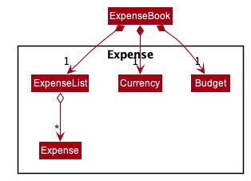

When executing `exchange` command, the `Currency` field will be changed if the input currency code is valid.

Given below is an example usage scenario and how the mechanism of exchange behaves at each step.

The following activity diagram summarizes what happens when a user executes the `exchange cc/cny`:

Fig. Activity Diagram for the Execution of `ExchangeCommand`
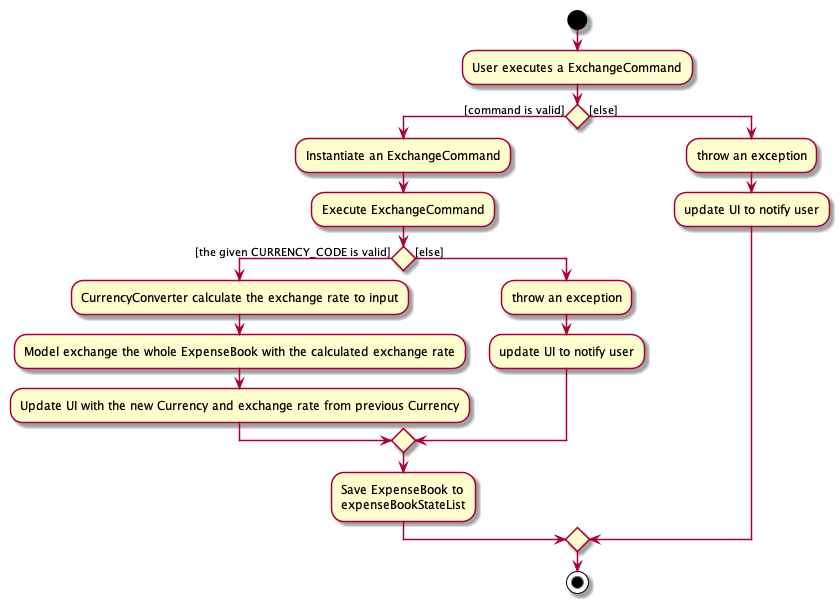

Step 1. The user launches the application.

Step 2. UniSave displays a list of existing expenses in the UI.

Step 3. The user executes `exchange cc/cny` to exchange the currency of the ExpenseBook from `SGD` (Default Currency) to `CNY`.

Step 4. The `ExchangeCommand` build a new `CurrencyConverter` to calculate the exchange rate from `SGD` to `CNY`. 
The `ExchangeCommand` exchanges the `Budget` and `ExpenseList` of `ExpenseBook` at the calculated exchange rate, and changes the `Currency` of the ExpenseBook to `CNY`.

The sequence diagram below shows the high-level abstraction of how UniSave processes user request to execute `exchange cc/cny`:

High Level Sequence Diagram for the Execution of `exchange cc/cny`

#### Design Considerations

##### Aspect: How to handle Exchange Rates
* Alternative 1: Let the user to type in real-time exchange rate.
** Pros: Correct input of the exchange rate can make the conversion more accurate.
** Cons: More prone to error, cannot check for incorrect exchange rates.

* Alternative 2: Let the user to download additional text file, and read the exchange rates from the text file.
** Pros: More flexibility when updating the exchange rates.
** Cons: 
(1) Users can modify the text file, more prone to error when parsing from the text file.
(2) More files to download other than `UniSave.jar`, less user-friendly.

## 3.8 Set Budget features

The set budget feature allows the user to set a budget for ExpenseBook.

Given below is an example usage scenario and how the mechanism of setting a budget behaves at each step.

The following activity diagram summarizes what happens when a user executes the `set-b BUDGET`:

Fig. Activity Diagram for the Execution of `SetBudgetCommand`
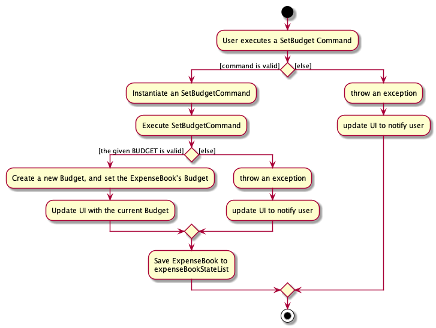

Step 1. The user launches the application.

Step 2. UniSave displays a list of existing expenses in the UI.

Step 3. The user executes `set-b 1000` to set a new budget for the ExpenseBook.
The `SetBudgetCommand` set the budget of ExpenseBook to be `1000` under current currency.

The sequence diagram below shows the high-level abstraction of how UniSave processes user request
to execute `set-b 1000`:

High Level Sequence Diagram for the Execution of `set-b 1000`
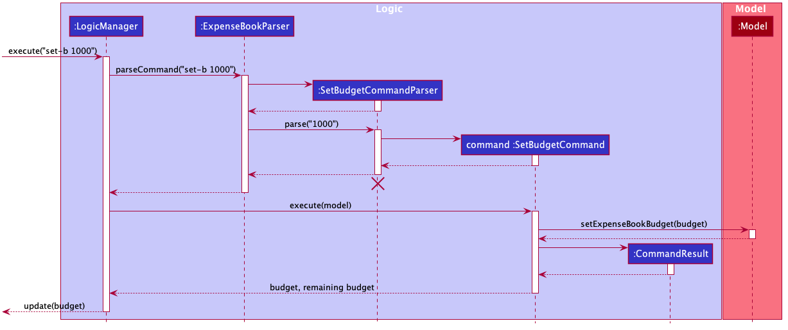

#### Design Considerations

##### Aspect: How do user check the updated budget.

* Alternative 1: Use ShowBudget Command `show-b`
** Pros: Simplier Implementation.
** Cons: Users cannot see their remaining budget all the time.

--------------------------------------------------------------------------------------------------------------------

## **Documentation, logging, testing, configuration, dev-ops**

* [Documentation guide](Documentation.md)
* [Testing guide](Testing.md)
* [Logging guide](Logging.md)
* [Configuration guide](Configuration.md)
* [DevOps guide](DevOps.md)

--------------------------------------------------------------------------------------------------------------------

## **Appendix: Requirements**

### Product scope

**Target user profile**:

* university international students who want to plan their finance
* prefer desktop apps over other types
* can type fast
* prefers typing to mouse interactions
* is reasonably comfortable using CLI apps
* spend various currency

**Value proposition**:

1. Problem: spending in different currency not tracked by many existing apps -> track spending in different currency
2. Problem: student exceeds budget, spending without control -> help you manage expense reasonably, save some money at the end of the month
3. Problem: student want to plan their finance, but writing them down is too troublesome -> this app is very convenient to use as users can record their finance any time they want
4. Problem: Student spend at various fields, too messy to record -> the labels functions allow students to organize their spending
5. Problem: Existing apps are complicated, not easy to use -> this app is simple to use and very user-friendly.

### User stories

Priorities: High (must have) - `* * *`, Medium (nice to have) - `* *`, Low (unlikely to have) - `*`

| Priority | As a …​                                    | I want to …​                     | So that I can…​                                                                  |
| -------- | ------------------------------------------ | ---------------------------------- | --------------------------------------------------------------------------------------- |
| `* * *`  | user                                       | Add an expense with category       | keep track of my accounts                                                               |
| `* * *`  | user                                       | View an expense                    | easily see the details such as dates, amount and descriptions of a specific expense     |
| `* * *`  | user                                       | Delete an expense                  | delete the expense when I added wrongly                                                 |
| `* * *`  | user                                       | List all expenses                  | view all expenses                                                                       |
| `* * *`  | user                                       | Tag an expense                     | view the specific task I spend on                                                       |
| `* * *`  | user                                       | Set budget                         | plan my expenses                                                                        |
| `* * *`  | user                                       | View budget                        | view how much i can spend before exceeding the monthly limit                            |
| `* * *`  | user                                       | Delete a tag of an expense         | delete the category label when I tagged wrongly                                         |
| `* *`    | user                                       | List all categories                | view all expenses                                                                       |
| `* *`    | user                                       | List all expenses in one category  | view all expenses spent under one category                                              |

*{More to be added}*

### Use cases

(For all use cases below, the **System** is the `AddressBook` and the **Actor** is the `user`, unless specified otherwise)

**Use case: Add expense with its category**

**MSS**

1.  User requests to list expenses
2.  UniSave shows a list of existing expenses
3.  User requests to add a category to a specific expense in the list
4.  UniSave adds the category input by user to the specific expense

    Use case ends.

**Extensions**

* 2a. The list is empty.

  Use case ends.

* 3a. The given index is invalid.

    * 3a1. UniSave shows an error message.

    Use case resume at Step 2

**Use case: View expense**

**MSS**

1.  User requests to list all the expenses
2.  UniSave shows a list of existing expenses

    Use case ends.

**Use case: Delete a current expense**

**MSS**

1.  User requests to list expenses
2.  UniSave shows a list of existing expenses
3.  User requests to delete a specific expenses in the list
4.  UniSave deletes the requested expense chosen by the user.

    Use case ends.

**Extensions**

* 2a. The list is empty.

  Use case ends.

* 3a. The given index is invalid.

    * 3a1. UniSave shows an error message.

      Use case resumes at step 2.

**Use case: Add a description to an expense**

**MSS**

1.  User requests to list expenses
2.  UniSave shows a list of expenses
3.  User requests to add a description to a specific expense in the list
4.  UniSave adds the description input by user to the specific expense

**Use case: Delete the current description of an expense**

**MSS**

1.  User requests to list expenses
2.  UniSave shows a list of expenses
3.  User requests to delete the description of a specific expense in the list
4.  UniSave deletes the description of expense chosen by the user.

    Use case ends.

**Extensions**

* 2a. The list is empty.

  Use case ends.

* 3a. The given index is invalid.

    * 3a1. UniSave shows an error message.

      Use case resumes at step 2.

**Extensions**

* 2a. The input category is invalid or does not exist.

    * 2a1. UniSave shows an error message.

      Use case resumes at step 2.

**Use case: List all expenses**

**MSS**

1.  User requests to list all the expenses
2.  AddressBook shows a list of expenses

    Use case ends.

**Use case: View category labels**

**MSS**

1.  User requests to list available category labels
2.  UniSave shows a list of existing category labels

    Use case ends.

**Use case: List all expenses in a specific category**

**MSS**
1.  User requests to list all the expenses in a specific category
2.  AddressBook shows a list of expenses in that category

**Use case: Set Budget**

**MSS**

1.  User requests to set a new budget.
2.  UniSave updates and displays the new budget and remaining budget in budget panel.

    Use case ends.

**Extensions**

* 1a. UniSave detects an error in the entered value.
    * 1a1. UniSave shows an error message with the correct usage of setting budget.
    * Use case ends.

**Use case: Exchange Currency**

**MSS**

1.  User requests to exchange the currency of ExpenseBook.
2.  UniSave updates and displays the new budget and remaining budget in budget panel.

    Use case ends.

**Extensions**

* 1a. UniSave detects an error in the entered value.
    * 1a1. UniSave shows an error message with the correct usage of setting budget.
    * Use case ends.

### Non-Functional Requirements

1. Should be able to function well without connecting to internet.
2. Should be accessed for a single user.
3. A user with above average typing speed for regular English text (i.e. not code, not system admin commands) should be able to accomplish most of the tasks faster using commands than using a mouse.
4. The product should be easy to use by a novice with no experience of using a finance tracking application.
5. Documentation should be easy to read and understand with proper highlighting.

### Glossary

* **Mainstream OS**: Windows, Linux, Unix, OS-X
* **Expense**: The amount of money spent by the user student in a certain event
* **Budget**: The maximum amount of money that the user student can spend

--------------------------------------------------------------------------------------------------------------------

## **Appendix: Instructions for manual testing**

Given below are instructions to test the app manually.

:information_source: **Note:** These instructions only provide a starting point for testers to work on;
testers are expected to do more *exploratory* testing.

### Launch and shutdown

1. Initial launch

   1. Download the jar file and copy into an empty folder

   1. Double-click the jar file Expected: Shows the GUI with a set of sample contacts. The window size may not be optimum.

1. Saving window preferences

   1. Resize the window to an optimum size. Move the window to a different location. Close the window.

   1. Re-launch the app by double-clicking the jar file. 
       Expected: The most recent window size and location is retained.

1. _{ more test cases …​ }_

### Add an expense

1. Add an expense into the expense book. Amount and category are compulsory. Date and description are optional.

   i.   Prerequisites: The amount entered need to be a valid one.
   ii.  Test case: `add a/50 c/ENTERTAINMENT t/1 d/movie`  
        Expected: A new expense is added into expense book. Details of the added expense shown in the result box.

   iii. Test case: `add a/50 c/ENTERTAINMENT` 
        Expected: A new expense is added into expense book. Since the `date` filed is empty, it will automatically set to today's date. Details of the added expense shown in the result box
   
   iv.  Test case: `add` 
        Expected: No expense is added. There will be an error message because the compulsory field instruction is missing.

   v.   Other incorrect add expense commands to try: `add a/100`, `add c/entertainment` (missing compulsory field) 
        Expected: Similar to previous test case.
        
### Add a description to current expenses

1. Add an description into the expense with the index specified. Index and description field are compulsory.

   i.   Prerequisites: The expense book is not empty.
   ii.  Test case: `add-d 1 d/movie`  
        Expected: A new description is added into the expense with the index specified. Details of the added description shown in the result box

   iii. Test case: `add-d 1 d/movie d/study` 
        Expected: A new description is added into expense with the index specified. When more than one descriptions are added, the last one is used. Details of the added description shown in the result box.
   
   iv.  Test case: `add-d` 
        Expected: No description is added. There will be an error message because the compulsory field instruction is missing.

   v.   Other incorrect add expense commands to try: `add-d 1`, `add-d d/` (missing compulsory field) 
        Expected: Similar to previous test case.

### Delete a description to current expenses

1. Delete an description into the expense with the index specified. Index and description field are compulsory.

   i.   Prerequisites: The expense book is not empty.
   ii.  Test case: `add-d 1 d/`  
        Expected: The description of the expense with the index specified is deleted. Details of the deleted description shown in the result box
   iii. Test case: `add-d` 
        Expected: No description is deleted. There will be an error message because the compulsory field instruction is missing.

   iv.   Other incorrect add expense commands to try: `add-d 1`, `add-d d/` (missing compulsory field) 
        Expected: Similar to previous test case.
        
### Clear all expenses

1. Clear all expenses in the expense book. The budget will also be cleared.

   i .  Test case: `clear`  
        Expected: All expenses and budget are cleared. The result box will show the information that all expenses are cleared.

### Edit an expense

1. Edit an expense specified by the index in the expense book. Index is compulsory followed by the field to be edited.

   i.   Prerequisites: The expense book is not empty .
   ii.  Test case: `edit 1 a/120`  
        Expected: The first expenses will be updated with an amount of 120. Details of the edited expense shown in the result box.

   iii. Test case: `edit 1 a/120 c/transport` 
        Expected: More than two fields are updated. The first expenses will be updated with an amount of 120 and category of transport. Details of the edited expense shown in the result box.
   
   iv.  Test case: `edit` 
        Expected: No expense is edited. There will be an error message because the compulsory field instruction is missing.

   v.   Other incorrect add expense commands to try: `edit 1`, `add c/entertainment` (missing compulsory field) 
        Expected: Similar to previous test case.
        
### Covert currency of current expenses to new currency

1. Currency of current expenses is converted to new specified currency. Currency code is case-insensitive but compulsory.

   i.   Test case: `exchange cc/CNY`  
        Expected: The currency of current expense is converted to Chinese Yuan specified by the currency code. Details of the currency conversion shown in the result box.

   ii.  Test case: `exchange` 
        Expected: No conversion is done. There will be an error message because the compulsory field instruction is missing.

   iii. Other incorrect add expense commands to try: `exchange CNY`, `exchange cc` (missing compulsory field) 
        Expected: Similar to previous test case.
        
### Delete an expense

1. delete an expense in the expense book. Index is compulsory.

   i.   Prerequisites: The expense book is not empty.
   ii.  Test case: `delete 1`  
        Expected: First expense is deleted from the list. Details of the deleted expense shown in the result box.

   iii. Test case: `delete 0` 
        Expected:No expense is deleted. There will be an error message because the index is invalid.

   iv.  Other incorrect add expense commands to try: `delete -1`(invalid index), `delete 10` (if the expense book has less than 10 expeneses)  
        Expected: Similar to previous test case.

### Exit from the application

1. Exit from the application

   i .  Test case: `exit`  
        Expected: Exit from the current application

### Filter by Category

1. Filter the expenses by category. Show all the expenses whose category match the specified category

   i.   Prerequisites: The expense book is not empty.
   ii.  Test case: `filter-c entertainment`  
        Expected:  Filter all the expenses under category entertainment.

   iii. Test case: `filter-c` 
        Expected: No expense is filtered. There will be an error message because the index is invalid.
        
### Filter by Date

1. Filter the expenses by date. Show all the expenses whose date match the specified date

   i.   Prerequisites: The expense book is not empty.
   ii.  Test case: `filter-t 2020-11-02`  
        Expected:  Filter all the expenses under the date 2020-11-02.

   iii. Test case: `filter-c` 
        Expected: No expense is filtered. There will be an error message because the command is invalid.

### Filter by Description

1. Filter the expenses by description. Show all the expenses whose description match the specified description.

   i.   Prerequisites: The expense book is not empty.
   ii.  Test case: `filter-d movie`  
        Expected:  Filter all the expenses for the description movie.

   iii. Test case: `filter-c` 
        Expected: No expense is filtered. There will be an error message because the command is invalid.

### Help Command

1. Provide a list of command for users to refer to.

   i .  Test case: `help`  
        Expected: There will be a command table shown with the link to the user guide.

### Listing all expenses

1. List all the expenses in the expense book.

   i.   Prerequisites: The expense book is not empty.
   ii.  Test case: `list`  
        Expected:  Show all the expenses in the expense book. The result box shows the successful message.

   iii. Other trivial list commands to try: `list x` (where x is any number or alphabet) 
        Expected: Similar to previous. The format of list command is not stated, so the list command is executed as long as the command word `list` is correct.

### Set budget for the expense book

1. Set budget for the expense book. The amount of the budget is compulsory.

   i.   Test case: `set-b 500`  
        Expected:  The budget of the expense book is set to $500. The result box shows the successful message.

   ii.  Test case: `set-b 0` 
        Expected: No budget is set. There will be an error message because the budget set is invalid.
        
   iii. Test case: `set-b` 
        Expected: No budget is filtered. There will be an error message because the index is invalid.

### Show Currency Code

1. Show the list of currency supported by the expense book as well as its corresponding code.

   i .  Test case: `show-codes`  
        Expected: There will be a command table the currency supported and its corresponding code.
   
   ii.  Other trivial list commands to try: `show-codes x` (where x is any number or alphabet) 
        Expected: Similar to previous. The format of `show-codes` command is not stated, so the `show-codes` command is executed as long as the command word `show-codes` is correct.
 
### Show Statistic

1. Show the statistic of the expenses.

   i .  Test case: `show-stats`  
        Expected: There will be a command table that provide a brief summary of the expenses.
   
   ii.  Other trivial list commands to try: `show-stats x` (where x is any number or alphabet) 
        Expected: Similar to previous. The format of `show-stats` command is not stated, so the `show-stats` command is executed as long as the command word `show-stats` is correct.
 

### Sort by amount

1. Sort the expenses by amount in ascending/descending order. The order is compulsory.

   i .  Test case: `sort-a ascending`  
        Expected: The expenses will be sorted by amount in ascending order.

   i .  Test case: `sort-a descending`  
        Expected: The expenses will be sorted by amount in descending order.
   
   iii. Test case: `sort-a` 
        Expected: Expenses are not sorted. There will be an error message because the compulsory field is missing.
 
### Sort by time

1. Sort the expenses by time in ascending/descending order. The order is compulsory.

   i .  Test case: `sort-t ascending`  
        Expected: The expenses will be sorted by time in ascending order.

   i .  Test case: `sort-t descending`  
        Expected: The expenses will be sorted by time in descending order.
   
   iii. Test case: `sort-t` 
        Expected: Expenses are not sorted. There will be an error message because the compulsory field is missing.
 
### View a specific expenses

1. View a specific index. The index is compulsory

   i .  Test case: `view 1`  
        Expected: View the first expenses. The result box shows the details of the expenses requested.

   ii.  Test case: `view`  
        Expected: No expense is viewed. There will be an error message because the compulsory field is missing.
        
   iii. Test case: `view 0`  
        Expected: No expense is viewed. There index of expense requested is invalid. 

### View all the categories.

1. View all the categories in the expense book. The category field is compulsory

   i .  Test case: `view-c`  
        Expected: Show all the categories in the expense book. The result box shows the successful message.

   ii.  Test case: `view-c x` (where x is any number or alphabet)  
        Expected: Similar to previous. The format of `view-c` command is not stated, so the `view-c` command is executed as long as the command word `view-c` is correct.
