UniSave is a **desktop app for managing expenses, optimized for use via a Command Line Interface** (CLI) 
while still having the benefits of a Graphical User Interface (GUI).
If you can type fast, UniSave can get your financial management tasks done faster than traditional GUI apps.
Choose a section from the table of contents below and start using UniSave.

* Table of Contents
    * [1. Overview](#1-overview)
    * [2. Quick start](#2-quick-start)
    * [3. Features](#3-features)
        * [3.1 Clear data: `clear`](#31-clear-data-in-unisave--clear)
        * [3.2 Set budget : `set-b`](#32-set-budget--set-b)
        * [3.3 Add an expense: `add`](#33-add-an-expense-add)
        * [3.4 Edit an expense: `edit`](#34-edit-an-expense--edit)
        * [3.5 Delete an expense: `delete`](#35-delete-an-expense-delete)
        * [3.6 View an expense : `view`](#36-view-an-expense--view)
        * [3.7 View categories : `view-c`](#37-view-categories--view-c)
        * [3.8 Add description to expense](#38-add-description-to-expense--add-d)
        * [3.9 Delete description of expense](#39-delete-description-of-expense-delete-d)
        * [3.10 Filter expenses](#310-filter-expenses)
            * [3.10.1 Filter by category: `filter-c`](#3101-filter-by-category-filter-c)
            * [3.10.2 Filter by date: `filter-t`](#3102-filter-by-date--filter-t)
            * [3.10.3 Filter by description: `filter-d`](#3103-filter-by-description--filter-d)
        * [3.11 List all expenses : `list`](#311-list-all-expenses--list)
        * [3.12 Sort expenses](#312-sort-the-expenses)
            * [3.12.1 Sort expenses by the amount of each expense: `sort-a`](#3121-sort-expenses-by-the-amount-of-each-expense-sort-a)
            * [3.12.2 Sort expenses by the date of each expense: `sort-t`](#3122-sort-expenses-by-the-date-of-each-expense-sort-t)
        * [3.13 Exchange Currency : `exchange`](#313-exchange-currency--exchange)
        * [3.14 Show Currency Codes: `show-codes`](#314-show-currency-codes-show-codes)
        * [3.15 Show Exchange Rates: `show-rates`](#315-show-exchange-rates-show-rates)
        * [3.16 Show Statistics: `show-stats`](#316-show-statistics-show-stats)
        * [3.17 View help: `help`](#317--view-help-help)
        * [3.18 Exiting the program : `exit`](#318-exit-the-program--exit)
        * [3.19 Saving the data](#319-saving-the-data)
    * [4. FAQ(Frequently Asked Question)](#4-faqfrequently-asked-question)
    * [5. Glossary](#5-glossary)
    * [6. Command Summary](#6-command-summary)

--------------------------------------------------------------------------------------------------------------------
## 1. Overview
UniSave is your desktop finance manager. 
It is an application that helps you manage your finance by tracking your spending, 
setting budget for each month, as well as viewing your expenses in various categories. 
Moreover, UniSave allows tracking expenses in different currencies.

UniSave targets university students who tend to incur a large amount of spending, 
including tuition fees, housing fees, transport and so on. 
It is catered especially for students who are more familiar with desktop applications and type fast.
UniSave is available for the Linux, Windows and Mac OS operating systems.

## 2. Quick start

1. Ensure you have Java `11` or above installed in your Computer.

2. Download the latest `UniSave.jar` from [here](https://github.com/AY2021S1-CS2103T-W10-1/tp/releases).

3. Copy the file to the folder you want to use as the _home folder_ for your UniSave.

4. For Windows user, double-click the file to start the app. 
For MacOS user, open your terminal and set the directory to be the same as UniSave, enter `java -jar UniSave.jar`.
In a few seconds, you should see a GUI similar to the diagram below. Note the app contains some sample data. 
   

5. Type the command in the command box and press `Enter` to execute it. 

   Some example commands you can try:

   * **`list`** : Lists all expenses.
   
   * **`set-b 1000`** : Set the budget of UniSave to be 1000 SGD (Singapore Dollar is the Default Currency for UniSave).

   * **`add a/50 c/entertainment t/1 d/yayymovie!`** : 
   Adds an expense of `50` SGD under category `entertainment` you spent `1` day ago (i.e. yesterday), 
   with `yayymovie!` description.

   * **`exchange cc/cny`** : Change the currency of the whole expense book to Chinese Yuan 
   (CNY is the currency code for Chinese Yuan).
   
   * **`show-stats`** : Show a statistic overview of all your expenses.
   
   * **`delete`**`1` : Deletes the expense with index 1.

   * **`exit`** : Exits the app.

6. Refer to the [Features](#3-features) below for details of each command.

--------------------------------------------------------------------------------------------------------------------

## 3. Features
* [3.1 Clear data: `clear`](#31-clear-data-in-unisave--clear)
* [3.2 Set budget : `set-b`](#32-set-budget--set-b)
* [3.3 Add an expense: `add`](#33-add-an-expense-add)
* [3.4 Edit an expense: `edit`](#34-edit-an-expense--edit)
* [3.5 Delete an expense: `delete`](#35-delete-an-expense-delete)
* [3.6 View an expense : `view`](#36-view-an-expense--view)
* [3.7 View categories : `view-c`](#37-view-categories--view-c)
* [3.8 Add description to expense](#38-add-description-to-expense--add-d)
* [3.9 Delete description of expense](#39-delete-description-of-expense-delete-d)
* [3.10 Filter expenses](#310-filter-expenses)
    * [3.10.1 Filter by category: `filter-c`](#3101-filter-by-category-filter-c)
    * [3.10.2 Filter by date: `filter-t`](#3102-filter-by-date--filter-t)
    * [3.10.3 Filter by description: `filter-d`](#3103-filter-by-description--filter-d)
* [3.11 List all expenses : `list`](#311-list-all-expenses--list)
* [3.12 Sort expenses](#312-sort-the-expenses)
    * [3.12.1 Sort expenses by the amount of each expense: `sort-a`](#3121-sort-expenses-by-the-amount-of-each-expense-sort-a)
    * [3.12.2 Sort expenses by the date of each expense: `sort-t`](#3122-sort-expenses-by-the-date-of-each-expense-sort-t)
* [3.13 Exchange Currency : `exchange`](#313-exchange-currency--exchange)
* [3.14 Show Currency Codes: `show-codes`](#314-show-currency-codes-show-codes)
* [3.15 Show Exchange Rates: `show-rates`](#315-show-exchange-rates-show-rates)
* [3.16 Show Statistics: `show-stats`](#316-show-statistics-show-stats)
* [3.17 View help: `help`](#317--view-help-help)
* [3.18 Exiting the program : `exit`](#318-exit-the-program--exit)
* [3.19 Saving the data](#319-saving-the-data)

**:information_source: Notes about the command format:** 

* Words in `UPPER_CASE` are the parameters to be supplied by the user. 
  e.g. in `add a/AMOUNT`, `AMOUNT` is a parameter which can be used as `add a/100`.
  
* Items in square brackets are optional (zero or one instance). 
  e.g `a/AMOUNT c/CATEGORY [t/date]` can be used as `a/100 c/shopping` or as `a/100 c/shopping t/2020-10-30`
  
* Parameters can be in any order. 
  e.g. if the command specifies `a/AMOUNT c/CATEGORY`, `c/CATEGORY a/AMOUNT` is also acceptable.
  
* Multiple instances of the same prefix/flag will not throw an error. However, the app will only read the <b>last instance</b> in the input.
  e.g. if `add a/100 c/entertainment c/food` will add the expense to "food" category.
  
* All additional input after commands which do not have input fields such as list, exit, clear, etc. will be ignored.
eg. `help` and `help 123` will have the same effect.

* Prefixes are case-sensitive.
eg. `d/` is not the same as `D/`.
  e.g. if the command specifies `a/AMOUNT c/CATEGORY, c/CATEGORY a/AMOUNT` is also acceptable.
  
* Here are the prefix used in our command.
  *   a/ : amount
  *   c/ : category
  *   t/ : date of expenses
  *   d/ : description for the expenses
  *   cc/ : currency code of currency

:bulb: **Tip:**
Pop up windows for <b>help</b>, <b>show-stats</b>, <b>show-rates</b>, <b>show-codes</b> commands can be closed with keyboard shortcut "<b>q</b>".

### Commands  

#### 3.1 Clear data in UniSave : `clear`

Clear all the data in the program. 

You can use this command to clear the sample data when you first launch the app, or use it whenever you want to start a new expense book.  
Note that budget will be cleared when you use this command.

Format: `clear`
Example: `clear`

Navigate back to the feature list: [Features](#3-features)

#### 3.2 Set budget : `set-b`

Set the budget for UniSave. Default budget is 0 Singapore Dollar (SGD). 
When total spending exceed the budget, UniSave will remind you to set a new budget.

Format: `set-b BUDGET`

Example:
`set-b 500`: Set the budget to 500.

**Note** :
1. You can change the Currency before setting budget with command <b>exchange cc/CURRENCY_CODE</b>, so that you can set your budget in another currency.
to see a full list of supported currencies with their currency codes use command <b>show-codes</b>.
2. Budget should only be positive numbers.

Navigate back to the feature list: [Features](#3-features)

#### 3.3 Add an expense: `add`

Adds an expense.

Format: `add a/AMOUNT c/CATEGORY [t/DATE] [d/description]`

**Note** :
1. The amount of an expense should only be positive numbers.  
2. If you do, a date can be entered in one of these two forms: 
  i) Enter date as a single integer, corresponding to number of days ago.  
  E.g: 1 means you made the expenses one day ago. (Note that when date is given as a single integer,
  it should not be less than 0 or greater than 3650.)  
  ii) Enter date as the exact date in YYYY-MM-DD format. E.g: 2020-10-28 
3.The date and field are optional but amount and category are compulsory.  
4. when more than one same field is entered, the last one is chosen. For example, there are t/2 and t/3 being entered, t/3 will be chosen.  
5. When the date field is left empty, the default is today. When description field is left empty, the default is no description.  
6. You may enter each field in a different order. That means `add a/100 c/food t/1 d/milk tea membership card` gives the 
   same result as `add t/1 d/milk tea membership card c/food a/100`.  

Examples:
* `add a/100 c/food t/1 d/milk tea membership card`
* `add a/50 c/entertainment t/2020-09-28 d/yayymovie!`
* `add a/100 c/food`

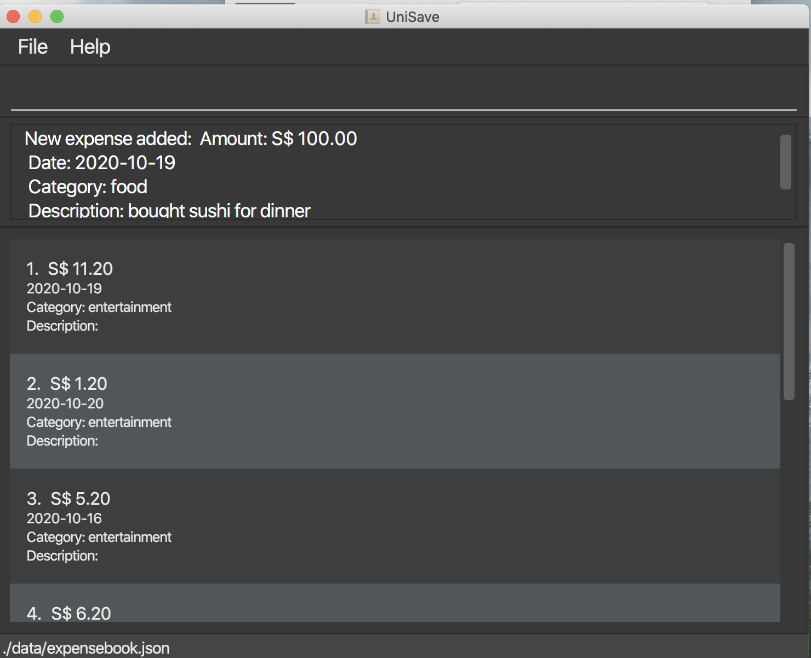

Navigate back to the feature list: [Features](#3-features)

#### 3.4 Edit an expense : `edit`

Edit an expense.

Format: `edit INDEX [a/AMOUNT] [c/CATEGORY] [t/DATE] [d/DESCRIPTION]`

* Edits the expense at the specified INDEX.
* The index refers to the index number shown in the expense list.
* The index **must be a positive integer greater than 0**. eg. 1, 2, 3, …
* If no field is provided, no change will be done.

Examples:
* `edit 1 a/10.2`
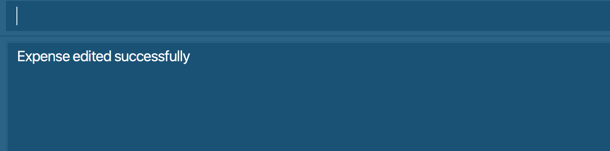

Navigate back to the feature list: [Features](#3-features)

#### 3.5 Delete an expense: `delete`

Deletes an expense.

Format: `delete INDEX`

* Deletes the expense at the specified `INDEX`.
* The index refers to the index number shown in the expense list.
* The index **must be a positive integer** 1, 2, 3, …

Examples:
* `list` followed by `delete 2` deletes the 2nd expense in the expense list.

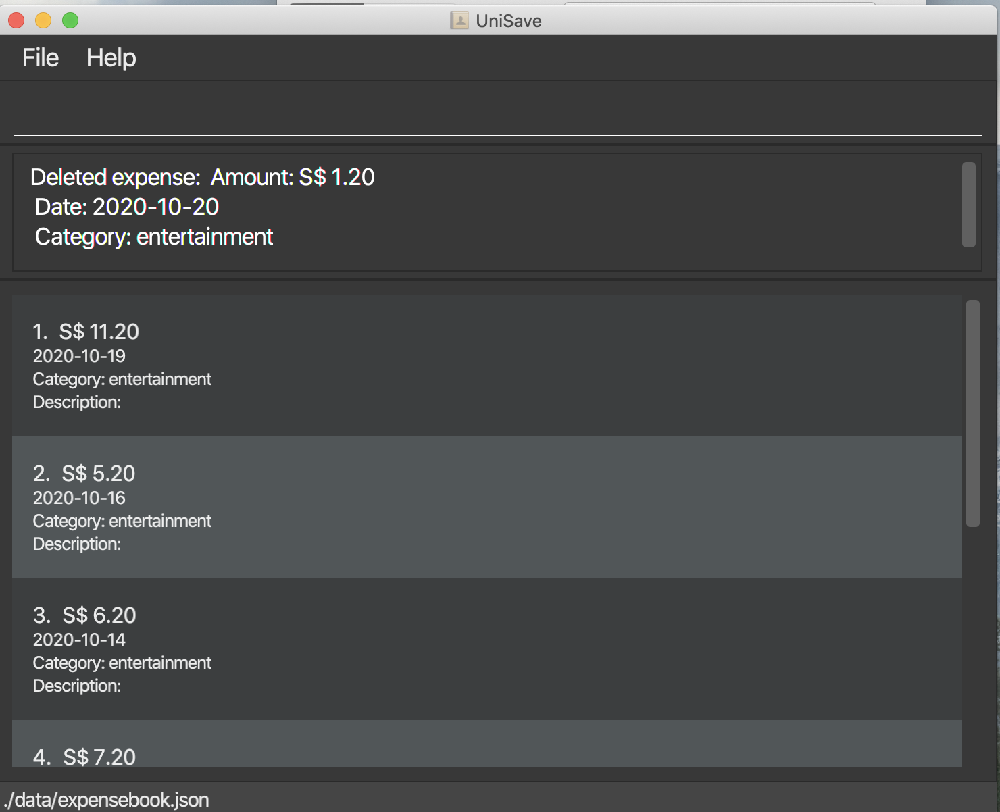

Navigate back to the feature list: [Features](#3-features)

#### 3.6 View an expense : `view`

View an expense in the expense list.

Format: `view INDEX`

View the expense at the specified INDEX.

The index refers to the index number shown in the displayed expense list.

* The index must be a **positive integer** 1, 2, 3, …

Examples:
* `view 3` views the `amount, category, date and description` of the third expense displayed in the list.

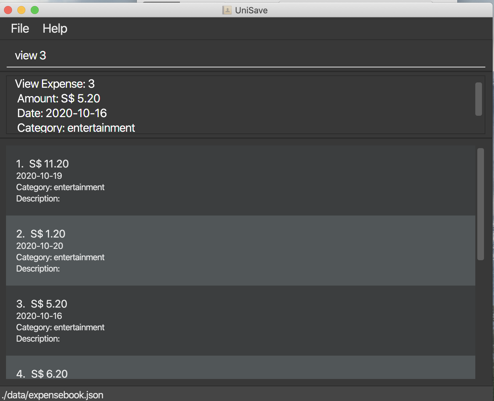

Navigate back to the feature list: [Features](#3-features)

#### 3.7 View categories : `view-c`

Show all existing categories in the expense list. Note that a category is added automatically when you add an expense.

Format: `view-c`

Examples:
* `view-c`

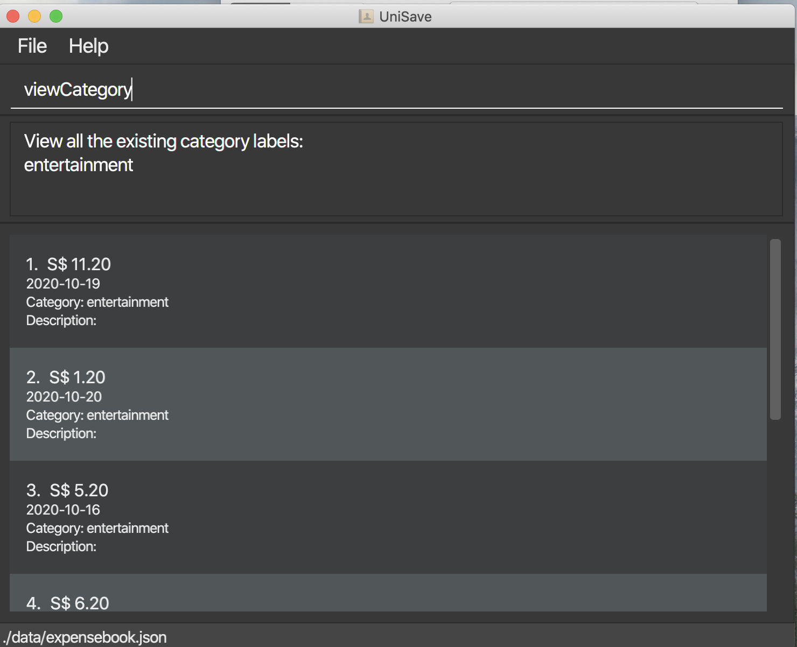

#### 3.8 Add description to expense : `add-d`

Add a description to an existing expense in the finance book.

**Note** :
1. The newly added description will override the existing description of the specified expense.
2. If you input `add-d 2`, this is invalid as the "d/" prefix is missing. If you put the description
field as "d/" or "d/  " (with blanks only), then the existing description will be removed.

Format: `add-d INDEX d/DESCRIPTION`
* Add description field to the expense at the specified `INDEX`. The `INDEX` refers to the index number shown in the displayed expense list. The index **must be a positive integer** 1, 2, 3, …​
* Existing description will be overwrote to the new description.
Examples:
* `add-d 3 d/movies`: Add the description field `movies` to the 3rd expense.

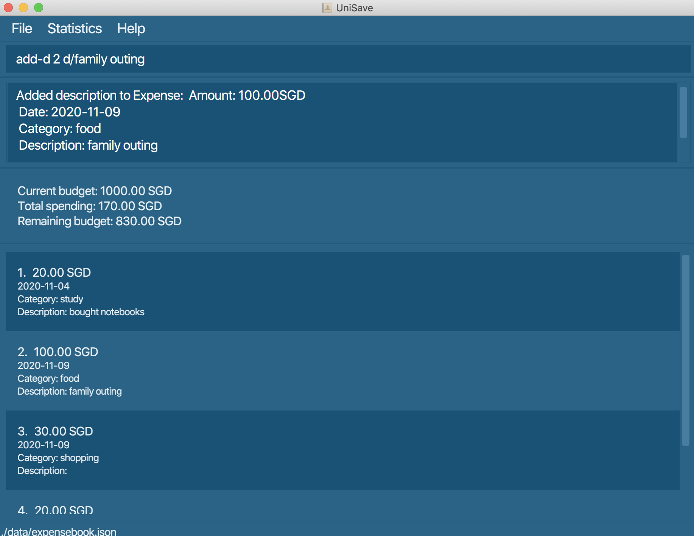

Navigate back to the feature list: [Features](#3-features)

#### 3.9 Delete description of expense: `delete-d`
Delete the description field of an existing expense.

**Note** :
The description field of the specified expense will still exist, just that it will be empty.

Format: `delete-d INDEX`
* Deletes the description of the expense at the specified INDEX.
* The `INDEX` refers to the index number shown in the expense list.
* The `INDEX` **must be a positive integer** 1, 2, 3, …​
Examples:
`delete-d 6` Deletes the description field of the 6th expense.

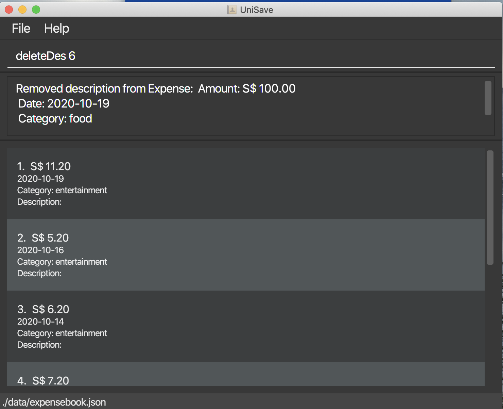

Navigate back to the feature list: [Features](#3-features)

#### 3.10 Filter Expenses

Filters for specific expense(s) based on the input command.

##### 3.10.1 Filter by category: `filter-c`

Show all the expenses whose category match the specified category.

Format: `filter-c CATEGORY`

Examples:
* `filter-c entertainment`: filter all the expenses under category `entertainment`.

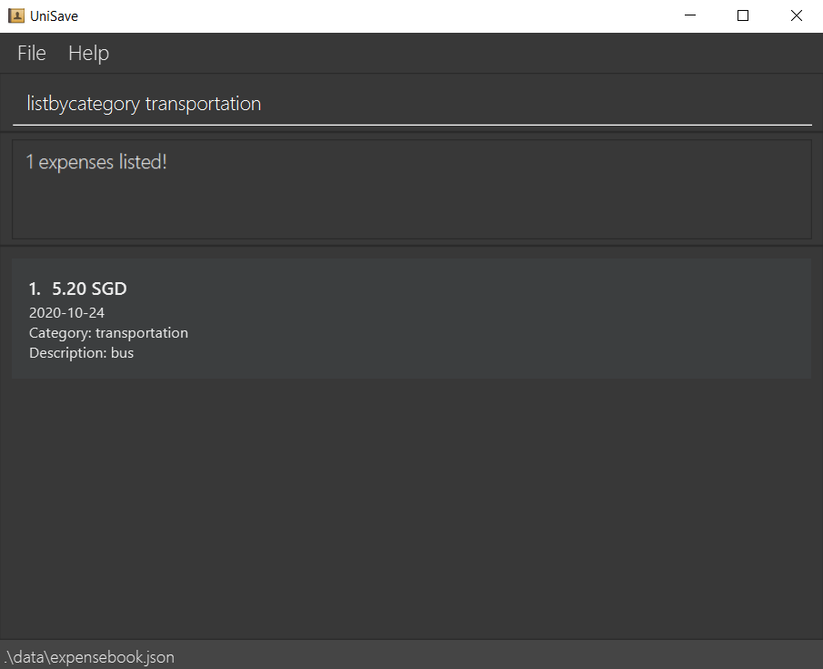

Navigate back to the feature list: [Features](#3-features)

##### 3.10.2 Filter by date : `filter-t`

Show all the expenses whose date match the specified date.

Format: `filter-t YYYY-MM-DD` or `filter-t NUMBEROFDAYSAGO`

:bulb: **Tip:**
NUMBEROFDAYSAGO is used to specify how many days ago from current day.
It accepts number from 0 to 3650 (10 years).

Examples:
* `filter-t 3`: filter all the expenses that are saved on 3 days ago from current day.
* `filter-t 2020-10-23`: filter all the expenses that are saved on `2020-10-23`.

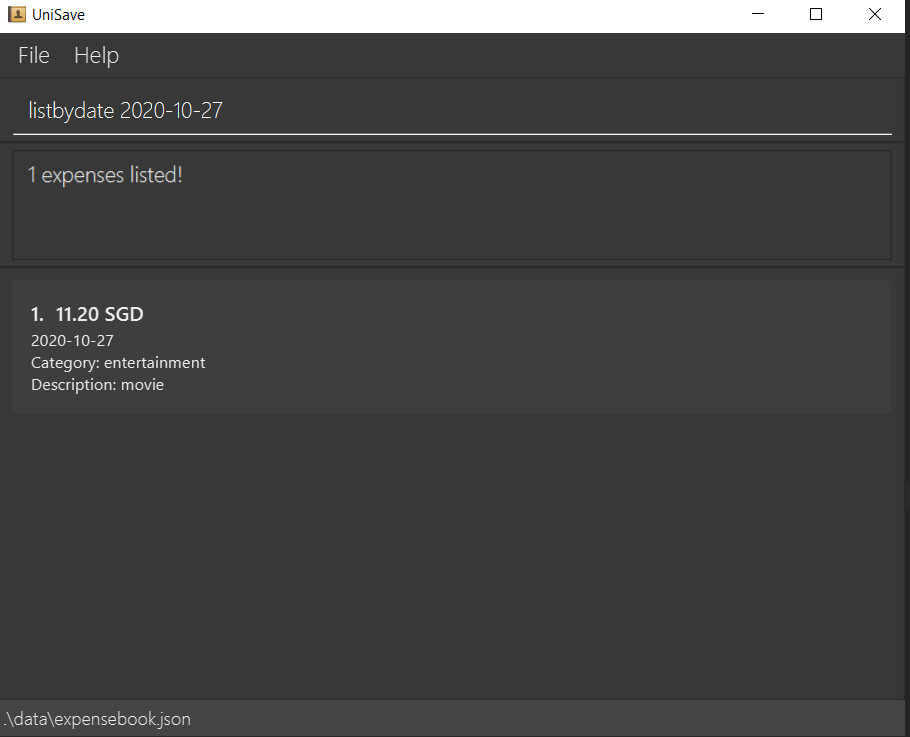

Navigate back to the feature list: [Features](#3-features)

##### 3.10.3 Filter by description : `filter-d`

Show all the expenses whose description contains the specified description.

Format: `filter-d DESCRIPTION`

:bulb: **Tip:**
Multiple description input is allowed.

Examples:
* `filter-d movie`: filter all the expenses which description has the keyword `movie`.

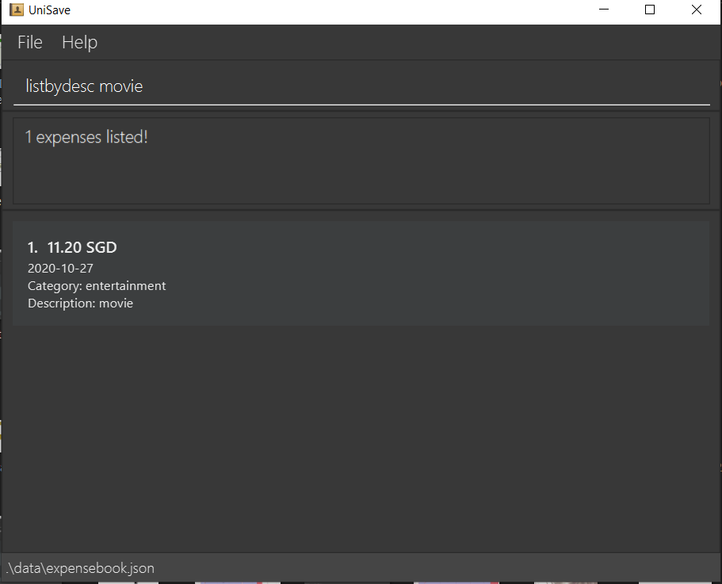

Navigate back to the feature list: [Features](#3-features)

#### 3.11 List all expenses : `list`

You can list out all the expenses stored in UniSave.

Format: `list`

Examples:
* `list`: list all the expenses in UniSave.

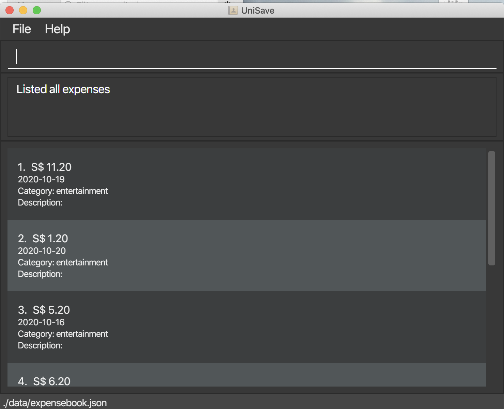

Navigate back to the feature list: [Features](#3-features)

#### 3.12 Sort the expenses

Sort the expense(s) based on the input command.

##### 3.12.1 Sort expenses by the amount of each expense: `sort-a`
Sort the expenses in specified order.

Format: `sort-a descending`
        `sort-a ascending`
* Note that only ascending or descending order is valid.

Examples:
* `sort-a ascending`: sort the expenses according to amount in ascending order.

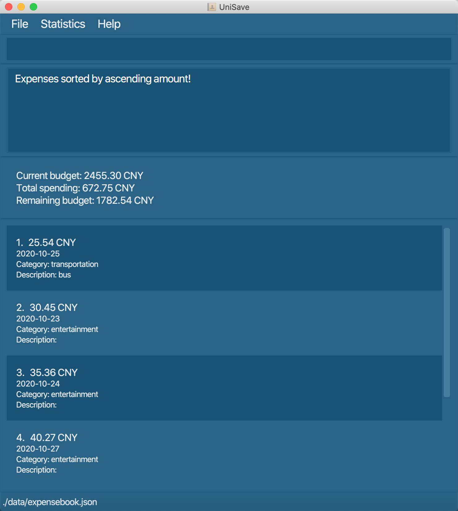

Navigate back to the feature list: [Features](#3-features)

##### 3.12.2 Sort expenses by the date of each expense: `sort-t`
Sort the expenses according to date in specified order. 

Format: `sort-t ascending`
        `sort-t descending`
* Note that only ascending or descending order is valid.

Examples:
* `sort-t ascending`: sort the expenses according to date in ascending order (i.e. from past to present.).

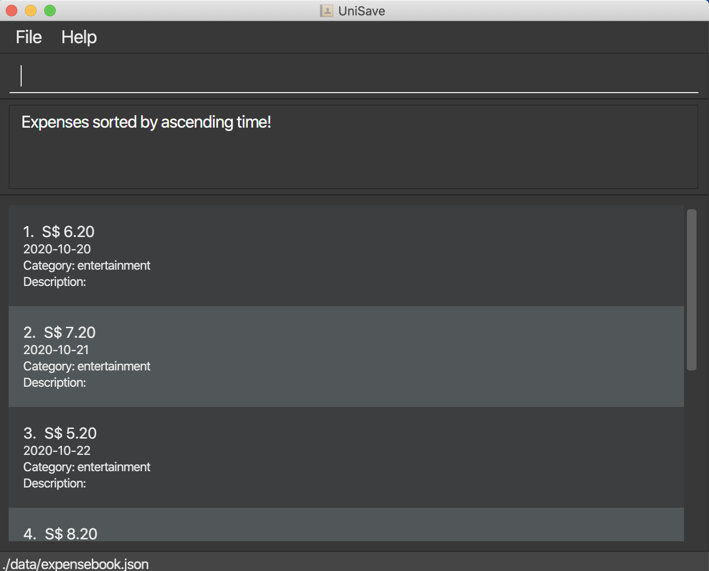

Navigate back to the feature list: [Features](#3-features)

#### 3.13 Exchange Currency : `exchange`
Convert the currency of UniSave from current currency to the input currency of the currency code, 
note that the currency code is case-insensitive.

:bulb: **Tip:**
Note that the currency code is case-insensitive. <b>cny</b> is the same as <b>CNY</b>.

:bulb: **Tip:**
Use command <b>show-codes</b> to see a full list of currency codes supported by UniSave.

Format: `exchange cc/CURRENCY_CODE`

Example: `exchange cc/CNY`

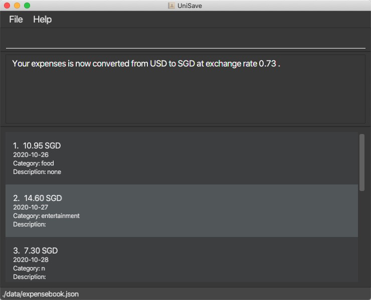

Navigate back to the feature list: [Features](#3-features)

#### 3.14 Show Currency Codes: `show-codes`
Show a full list of supported currencies with their corresponding currency codes.

Format: `show-codes`

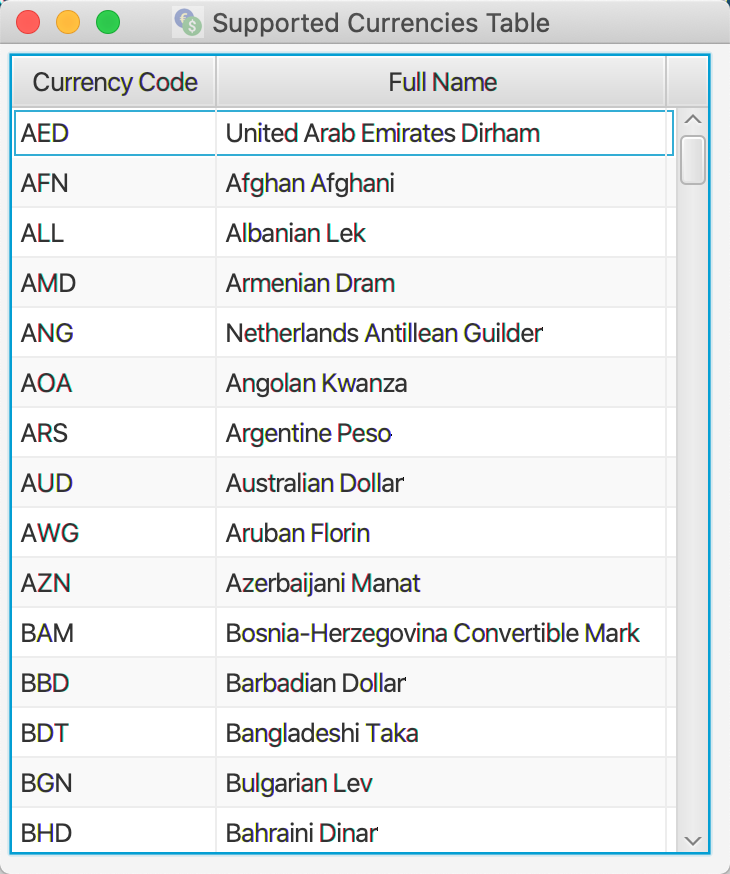

Navigate back to the feature list: [Features](#3-features)

#### 3.15 Show Exchange Rates: `show-rates`
Show a full list of exchange rates adapted by UniSave. 
Note that the exchange rates were last updated at 2020-10-31 from currency-layer website, 
there may be a slight inaccuracy compared to current exchange rates.

Format: `show-rates`

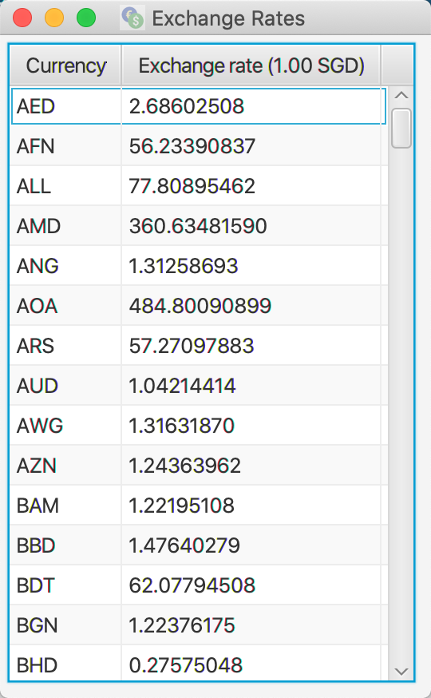

Navigate back to the feature list: [Features](#3-features)

#### 3.16 Show Statistics: `show-stats`
Show a statistic overview of the expenses, 
such as the total number of expenses as well as the total spending in each category.

There are arranging in descending order in which the category that you spent the most will be on the first row.

Format: `show-stats`

Examples: `show-stats`

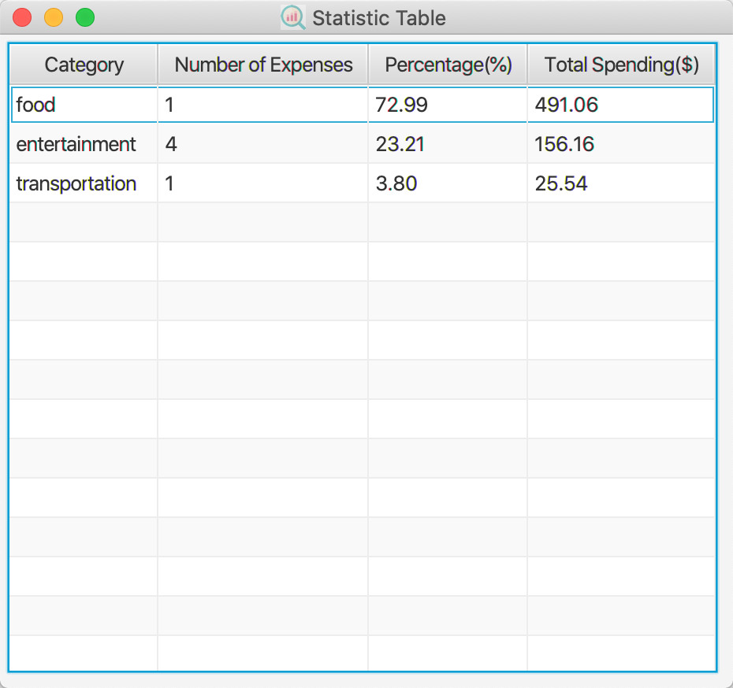

Navigate back to the feature list: [Features](#3-features)

#### 3.17 : View help: `help`

Opens a window with a link that directs you to our user guide, and a table shows all the commands of UniSave.

Format: `help`

Navigate back to the feature list: [Features](#3-features)

#### 3.18 Exit the program : `exit`

Exits the program.

Format: `exit`

Navigate back to the feature list: [Features](#3-features)

#### 3.19 Saving the data

UniSave data are saved in the hard disk automatically after any command that changes the data. 
There is no need to save manually.

Navigate back to the feature list: [Features](#3-features)

--------------------------------------------------------------------------------------------------------------------

## 4. FAQ(Frequently Asked Question)
**Q**: How do I transfer my data to another Computer? 
**A**: Install the app in the other computer and overwrite the empty data file it 
creates with the file that contains the data of your previous UniSave home folder.  
--------------------------------------------------------------------------------------------------------------------

## 5. Glossary 

Term | Explanation
--------|------------------
**UniSave** | UniSave refers to the name of the application.
**Expense** | An expense consists of an amount spent in some currency, the date on which you spend the money, a category that you classify this spending into, and a description so that you can recall the details when you view this spending again later.
**CLI** | A command-line interface (CLI) processes commands to a computer program in the form of lines of text.
**GUI** | The graphical user interface is a form of user interface that allows users to interact with a computer program through graphical icons instead of text-based user interfaces or text navigation.

--------------------------------------------------------------------------------------------------------------------

## 6. Command Summary

Action | Format, Examples
--------|------------------
**Clear data**|`clear`
**Set budget** | `set-b BUDGET`   e.g., `set-b 1000`
**Add** | `add a/AMOUNT c/CATEGORY [t/DATE] [d/DESCRIPTION]`   e.g., `add a/100 c/food`
**Edit** | `edit INDEX [a/AMOUNT] [c/CATEGORY] [t/DATE] [d/DESCRIPTION]`   e.g., `edit 1 a/12`
**Delete** | `delete INDEX`   e.g., `delete 3`
**View** | `view INDEX`   e.g., `view 5`
**View categories** | `view-c`
**Add description** | `add-d INDEX d/DESCRIPTION`   e.g., `add-d 5 d/had dinner`
**Delete description** | `delete-d INDEX`   e.g., `delete-d 5`
**Filter by category** | `filter-c CATEGORY`   e.g., `filter-c food`
**Filter by date** | `filter-t YYYY-MM-DD`   e.g., `filter-t 2020-02-20`
**Filter by description** | `filter-d DESCRIPTION`   e.g., `filter-d movies`
**List** | `list`
**Sort by amount** | `sort-a ORDER`   e.g., `sort-a acsending`
**Sort by date** | `sort-t ORDER`   e.g., `sort-t descending`
**Exchange Currency** | `exchange cc/CURRENCY_CODE`   e.g., `exchange cc/CNY`
**Show Currency Codes** | `show-codes`
**Show Exchange Rates** | `show-rates`
**Show Statistic** | `show-stats`
**Help** | `help`   e.g., `help`
**Exit** | `exit`   e.g., `exit`
